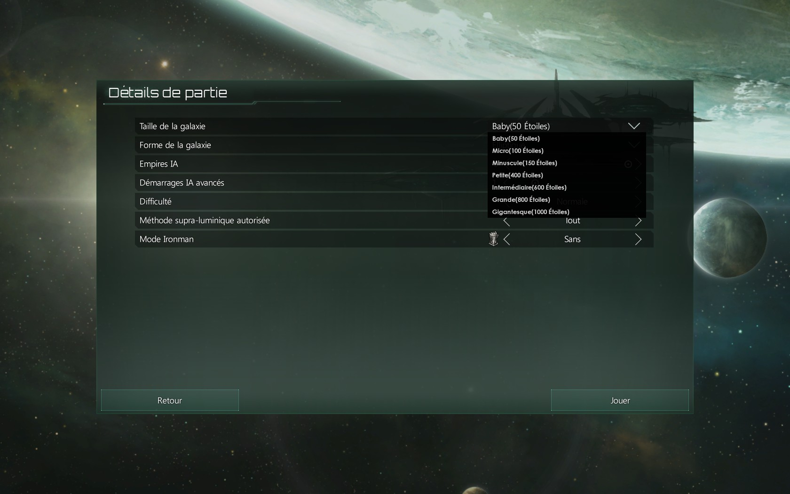
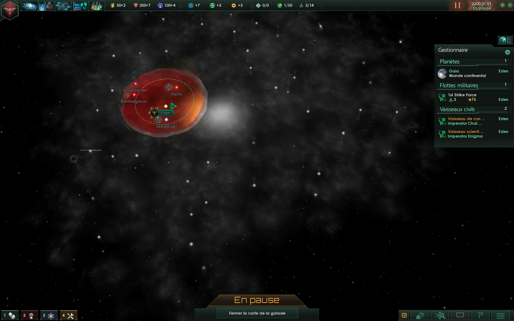
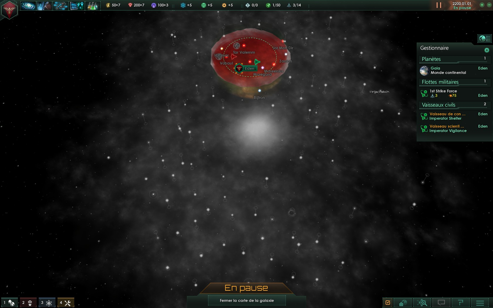

# Stellaris Mod - Micro System

## LICENSE

[GNU GENERAL PUBLIC LICENSE V3](LICENSE)

## DESCRIPTION

_EN :_ This little mod add Micro System (100 stars) and Baby System (50 stars).
 Use for a very fast game.
 _Compatible with other mod : size of the galaxy_

_FR :_ Ce petit mode ajoute Micro Système(100 étoiles) et Baby Système (50 étoiles).
 A utiliser pour les parties très rapides.
 _Compatible avec d'autre mod : taille de la galaxie_

### STATS

* Mod : GamePlay
* Status Development : Complet
* Gamer : Very fast game

### SCREENSHOT

